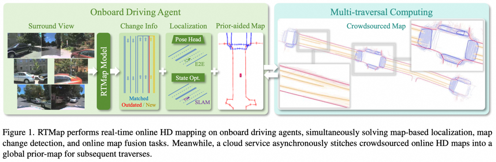
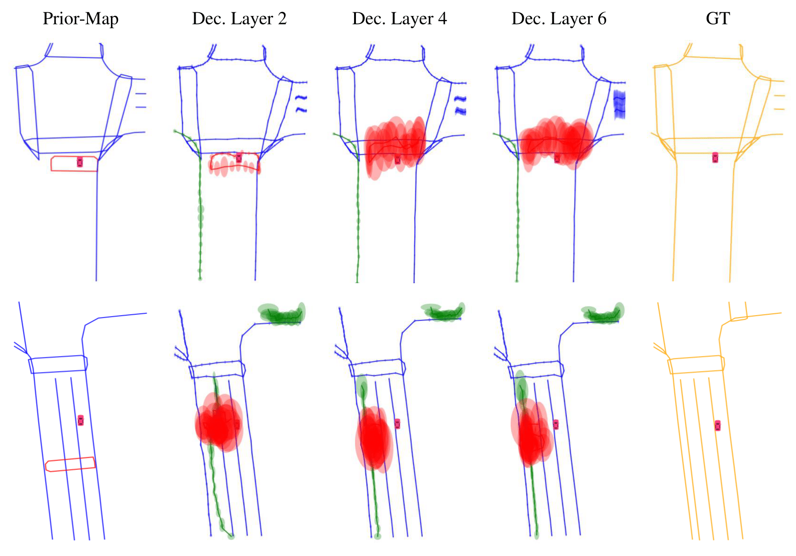

# RTMap
> Yuheng Du†, Sheng Yang†*, Lingxuan Wang, Zhenghua Hou, Chengying Cai, Zhitao Tan, Mingxia Chen, Shi-Sheng Huang, Qiang Li

This is the official implementation of **RTMap: Real-Time Recursive Mapping with Change Detection and Localization** (ICCV 2025).

<!-- [[Paper](https://arxiv.org/abs/2506.21547)] [[Project Page](https://sam4d-project.github.io/)]. -->

## Abstract
While recent online HD mapping methods relieve burdened offline pipelines and solve map freshness, they remain limited by perceptual inaccuracies, occlusion in dense traffic, and an inability to fuse multi-agent observations. We propose RTMap to enhance these single-traversal methods by persistently crowdsourcing a multi-traversal HD map as a self-evolutional memory. On onboard agents, RTMap simultaneously addresses three core challenges in an end-to-end fashion: (1) Uncertainty-aware positional modeling for HD map elements, (2) probabilistic-aware localization w.r.t. the crowdsourced prior-map, and (3) real-time detection for possible road structural changes. Experiments on several public autonomous driving datasets demonstrate our solid performance on both the prior-aided map quality and the localization accuracy, demonstrating our effectiveness of robustly serving downstream prediction and planning modules while gradually improving the accuracy and freshness of the crowdsourced prior-map asynchronously.

  

## Incoming
- [ ] Inference Demo
- [ ] Relabeled TbV val split
- [ ] TbV train/sythetic val split with perturbed prior-map

## Getting Started

## Qualitative results on TbV Synthetic Val Split

  
 

## Acknowledgement

We respect to our past and present colleagues for their unwavering dedication to pursuing innovative lighter-map solutions, whose contributions have profoundly bring-up this work. 

We gratefully acknowledge the developers of the following open-source projects and datasets, whose foundational tools enabled our research: [MapTR/MapTRv2](https://github.com/hustvl/MapTR), [TbV](https://github.com/johnwlambert/tbv), [MapUncertaintyPrediction](https://github.com/alfredgu001324/MapUncertaintyPrediction), among others.
